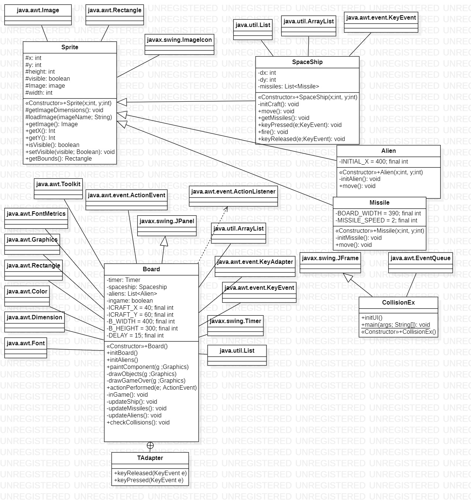
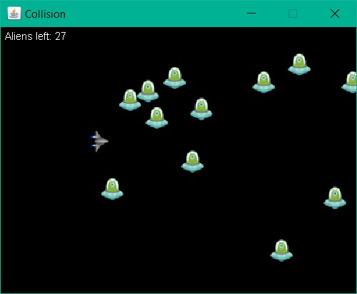

## Collision

Dalam game ini terdapat clas sebagai berikut:
#1. Sprite Class
	Kelas ini akan menjadi super class dari kelas space ship, alien dan missile
	method yang ada di kelas ini adalah:
		1. <Construstor> sprite 
			digunakan untuk menginisialisasi posisi dari space ship, alien dan missile
		1. getImageDimension
			Digunakan untuk mengatur ukuran gambar spaceship, alien dan missile
		2. loadImage
			Berfungsi untuk menampilkan atau memasukkan gambar
		3. getImage 
			Mengembalikan nilai berupa gambar
		4. getX dan getY
			Mendapatkan titik awal posisi gambar
		5. setVisible
			Mengatur gambar untuk ditampilkan dilayar atau tidak
		6. isVisible 
			Untuk mengetahui apakah gambar tersebut dalam mode visible atau tidak
		7. getBound
#2. SpaceShip Class (extends Sprite)
	Kelas ini digunakan untuk membuat dan mengatur objek pesawat ruang angkasa yang akan kita kendalikan
	Objek dalam kelas ini:
		1. Missiles
			Peluru yang akan ditembakkan ke arah alien
	Method yang dalam kelas ini:
		1. <Constructor> SpaceShip
			Menginisialisai titik awal dari space ship
		2. initCraft
			Membuat daftar misil yang akan ditembakkan dalam bentuk array dan menampilkan gambar spaceship
		3. getMissiles
		4. keyPressed
			Untuk mengatur gerakan dan aksi setelah user memberi perintah
		5. fire
			Digunakan untuk menambahkan satu misil ketika user memberikan perintah untuk menembak
		6. keyRealeased
			Mengatur space ship agar diam saat tidak ada perintah dari user
#3. Alien Class (extends Sprite)
	Kelas ini digunakan membuat dan mengatur pergerakan objek alien
	Method:
		1. <Constructor> Alien
			Menginisialisasi titik awal alien
		2. initAlien
			Menampilkan gambar alien
		3. move
			Untuk mengatur gerakan setiap alien dan membuat alien kembali ke sisi kanan layar saat alien mencapai sisi kiri layar
#4. Missile Class (extends Sprite)
	Kelas ini digunakan untuk membuat 
	Method:
		1. <constructor> Missile
			menginisialisasi letak awal misil
		2. initMissile
			Menampilkan gambar misil
		3. move
			Menggerakkan misil sesuai dengan kecepatan yang telah ditentukan
#5. Board Class (extends JPanel implements ActionListener)
	Kelas ini berfungsi untuk mengatur dan menginisialisasi hal-hal yang ada pada tampilan permainan
	Method:
		1. pos
			Mengatur posisi awal alien-alien
		2. Board dan initBoard
			Digunakan untuk menampilkan penampilan awal permainan
			seperti letak space ship dan sisa alien yang harus dikalahkan
		3. initAlien
			Membuat objek alien dalam bentuk array
		4. paintComponen
			Melakukan antara menampilkan permainan atau menampilkan pesan "game over"
		5. drawObject
			Menampilkan gambar awal permainan seperti space shipnya
		6. drawGameOver
			Menampilkan pesan "game over"
		7. actionPerformed
			Memperbarui letak dan tampilan setiap objek setelah adanya aksi
		8. inGame
		9. updateShip
			Memperbarui letak space ship setiap adanya aksi
		10. updateMissile
			Memperbarui letak dan tampilan misil, serta membuang misil yang sudah bertabrakan dengan alien
		11. updateAlien
			Cek apakah terdapat alien yang tersisa, jika iya maka perbarui letak dan tampilannya
			jika tidak, maka keluarkan pesan game over
		12. checkCollsion
			Untuk mengecek apakah terdapat tabrakan atau tidak
#6. CollisionEx (extends JFrame)
	Main Class yang digunakan untuk mengeksekusi jalannya program
	Method:
		1. <Constructor> CollisionEx dan initUI
			Membuat frame permainan, judul dan operasi pada frame permainan
		2. main()
			Method untuk mengeksekusi permainan
	
Class Diagram Image

Running Program Image

