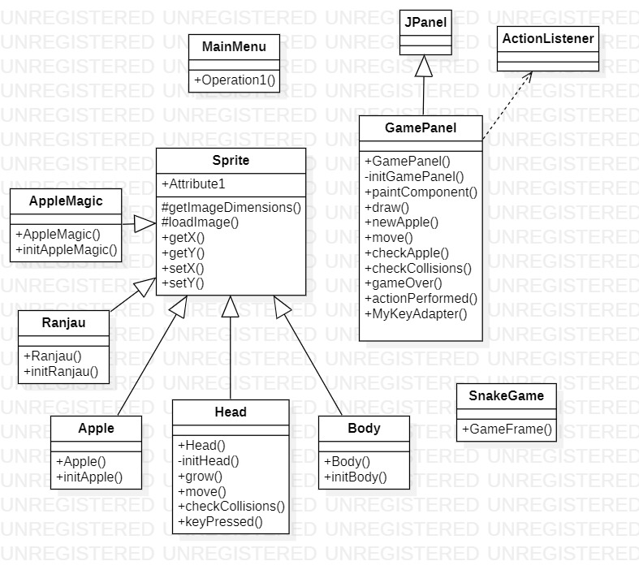

# PBO-F-Project

Nama Anggota:
1. Salman Damai Alfariq           - 05111940000159
2. Muhammad Fikri Sandi Pratama   - 05111940000195
3. Muhammad Rizky Widodo          - 05111940000216

### Snake Game

Game yang sudah populer di kalangan masyarakat. Game ini memiliki beberapa objek seperti ular dan apel. Cara memainkannya adalah dengan mengendalikan Gerakan ular yang di gerakkan lewat keyboard up, down, left and right dalam permainan. Tujuannya adalah memakan sebanyak mungkin apel yang muncul tanpa menabrak tembok ataupun badan dari ular itu sendiri serta untuk mendapatkan score tertinggi dan mencapai panjang maksimal dari ular. Karena ketika ular sudah memiliki panjang yang sudah di maksimalkan kemungkinan ular tidak bisa berputar-putar di map lagi, ada beberapa fitur yang terdapat di game ini yaitu: 

### Fitur
1.	Adanya pergantian warna/skin dari ular.
Memungkinakna pemain untuk mengganti warna atau pola tubuh ular yang dikendalikan
2.	Terdapat pilihan level
Semakin tinggi level yang dipilih, semakin cepat Gerakan ular dan akan semakin sulit dikendalikan. Jika memungkinkan, akan ada tambahan tembok penghalang untuk mempersempit ruang gerak ular.
3.	Adanya racun/ranjau
Jika yang dimakan adalah racun, maka akan mengurangi poin yang telah didapatkan atau menyebabkan game over
4. Adanya AppleMagic
Jika memakan AppleMagic highscore akan dikalikan menjadi 2x lipat dari biasanya namun mempunyai batas waktu

### Class
1.	Menu
Tampilan awal sebelum memulai permainan dan tempat memilih tampilan dari ular yang dikendalikan dan tingkatan level.
2.	Apple
Dibuat untuk membuat apel sebagai makanan ular
3.	Body
Untuk membuat bagian-bagian tubuh ular. Jika tubuh ular semakin Panjang, maka akan dibuat objek body lagi untuk menambah konponen tubuh.
4.	Head
Objek dari class Head ini lah yang akan kita kendalikan, dan objek bagian-bagian tubuhnya akan mengikuti gerakan dari objek  Head ini.
5.	Sprite
Sebagai super class dari kelas Apple, Body, head, Magic Apple, dan Poison.
6.	Game Panel
Class yang berfungsi sebagai pengatur jalannya permainan.
7.	Snake Game
Main class untuk menjalankan program.
5.	Magic Apple
Berfungsi untuk memunculkan Magic Apple yang jika berhasil dimakan, akan mendapat skor dua kali lipat apel biasa. Kemunculan Magic Apple ini memiliki Batasan waktu dan persentasi ter tentu untuk muncul.
6.	Poison
Membuat ibjek racun yang jika dimakan, akan menyebabkan turunnya skor yang telah didapatkan namun panjang tubuh ular akan tetap. Sehingga mengurangi jumlah skor maksimal yang akan didapatkan olehh pemain. Objek ini juga memiliki Batasan waktu untuk muncul dan hanya muncul dengan persentase tertentu saja.

Class Diagram Image

### Refrensi
http://zetcode.com/javagames/snake/
